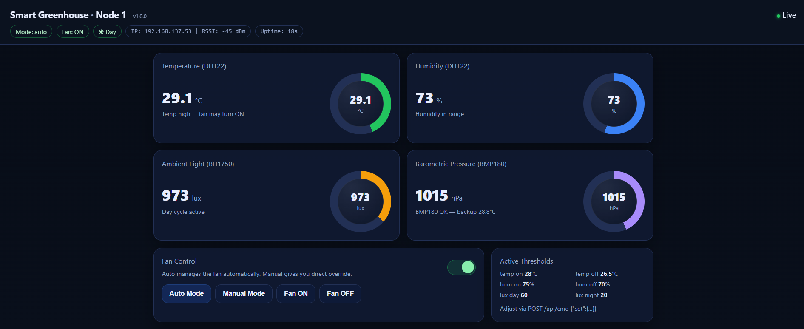
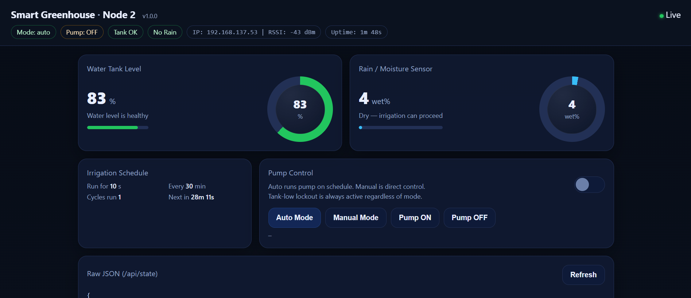
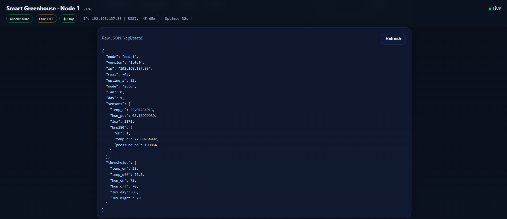
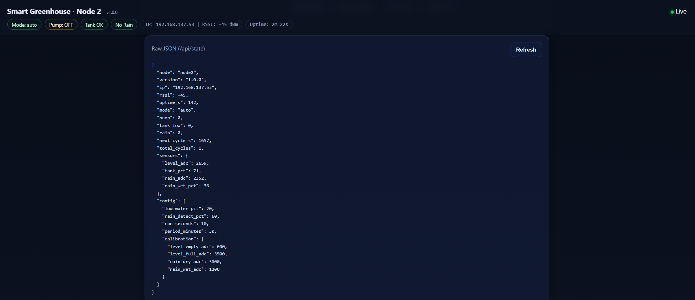
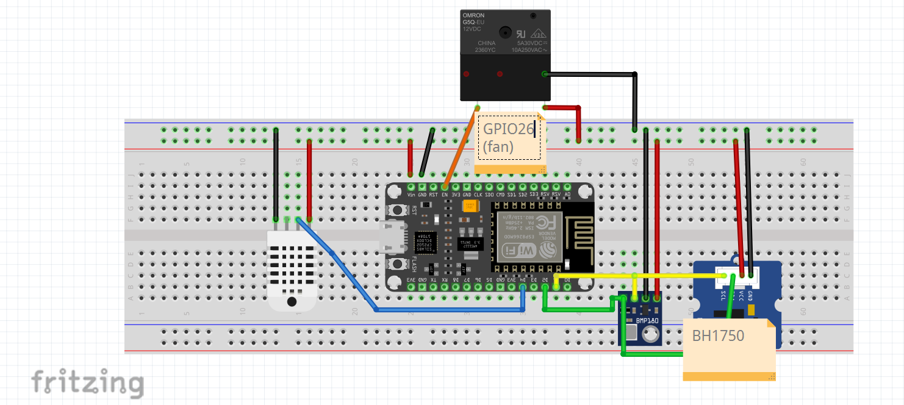

# Smart IoT Greenhouse System

I built this as a production-ready, dual-node ESP32 greenhouse automation system. Each node runs independently on the local WiFi network, serves its own web dashboard, and exposes a REST API that can be used from a browser, Home Assistant, Node-RED, or any HTTP client.

Node 1 manages the greenhouse climate. It reads temperature, humidity, light intensity, and barometric pressure, then controls the ventilation fan with hysteresis so the relay does not chatter around the threshold.

Node 2 manages irrigation. It reads the water tank level and rain sensor, then runs the water pump on a configurable schedule. Low-water lockout and rain detection are built into the control logic so the pump does not run when it should be protected.

## Portfolio Preview

### Dashboards

| Node 1 - Climate dashboard | Node 2 - Irrigation dashboard |
|---|---|
|  |  |
|  |  |

### Hardware Diagrams

| System architecture | Node 1 wiring | Node 2 wiring |
|---|---|---|
|  |  |  |

## What I Implemented

- Live browser dashboards with gauges, status indicators, and automatic refresh.
- Local REST APIs on both nodes with JSON state and command endpoints.
- ESP32 WiFi station mode with automatic reconnect behavior.
- mDNS hostnames: `greenhouse-node1.local` and `greenhouse-node2.local`.
- Persistent configuration using ESP32 NVS flash.
- Hardware watchdog timers so a stuck loop causes a controlled reboot.
- Node 1 fan automation using separate ON and OFF thresholds.
- Node 2 pump automation using schedule, tank level protection, and rain lockout.
- CORS headers for dashboard/API integration from other local tools.
- Version strings in each `/api/state` response for easier maintenance.

## Hardware

### Node 1 - Climate Control

| Component | Part | Interface | GPIO |
|---|---|---|---|
| Microcontroller | ESP32 38-pin dev board | USB / WiFi | - |
| Temperature + humidity | DHT22 | Digital 1-wire | 4 |
| Light sensor | BH1750 | I2C | SDA=21, SCL=22 |
| Pressure sensor | BMP180, optional | I2C | SDA=21, SCL=22 |
| Ventilation fan | Active-LOW relay module | Digital output | 26 |

### Node 2 - Irrigation Control

| Component | Part | Interface | GPIO |
|---|---|---|---|
| Microcontroller | ESP32 38-pin dev board | USB / WiFi | - |
| Tank level sensor | Capacitive analog sensor | ADC1 | 34 |
| Rain sensor | Analog resistive sensor | ADC1 | 35 |
| Water pump | Active-LOW relay module | Digital output | 27 |

ADC note: I used ADC1 pins for the analog sensors because ESP32 ADC2 is shared internally with the WiFi radio and becomes unreliable while WiFi is active.

## Repository Structure

```text
Smart_IoT_GreenHouse/
|-- Node1/
|   |-- platformio.ini
|   `-- src/
|       `-- main.cpp
|-- Node2/
|   |-- platformio.ini
|   `-- src/
|       `-- main.cpp
|-- node1_circuit_diagram.png
|-- node2_circuit_diagram.png
|-- Node1_dashboard.png
|-- Node1_dashboardpt.2.png
|-- Node2_dashboard.png
|-- Node2_dashboardpt.2.png
|-- System_Architecture_Diagram.png
|-- README.md
|-- LICENSE
`-- .gitignore
```

## Setup

This project uses PlatformIO. PlatformIO handles the ESP32 toolchain, library downloads, build process, upload process, and serial monitor.

### 1. Install PlatformIO

Recommended option:

1. Install Visual Studio Code.
2. Install the PlatformIO IDE extension.
3. Open either `Node1/` or `Node2/` as the active PlatformIO project.

CLI option:

```bash
pip install platformio
```

### 2. Configure WiFi

Before flashing, update these lines in both `Node1/src/main.cpp` and `Node2/src/main.cpp`:

```cpp
#define WIFI_SSID     "YOUR_WIFI_SSID"
#define WIFI_PASS     "YOUR_WIFI_PASSWORD"
```

The ESP32 connects to 2.4 GHz WiFi. Most ESP32 development boards do not support 5 GHz networks.

### 3. Flash Node 1

```bash
cd Node1
pio run --target upload
pio device monitor
```

The serial monitor prints the assigned IP address after the board connects.

### 4. Flash Node 2

```bash
cd Node2
pio run --target upload
pio device monitor
```

The Node 2 serial monitor also prints ADC readings that I use for level and rain sensor calibration.

### 5. Open the Dashboards

After both boards connect to WiFi:

```text
http://greenhouse-node1.local/
http://greenhouse-node2.local/
```

If mDNS is not available on the network, use the IP addresses printed in the serial monitor:

```text
http://<node1-ip>/
http://<node2-ip>/
```

## API Reference

Both nodes expose the same route pattern.

### `GET /api/state`

Returns a JSON snapshot of the current node state.

Node 1 example:

```json
{
  "node": "node1",
  "version": "1.0.0",
  "ip": "192.168.1.42",
  "rssi": -58,
  "uptime_s": 3721,
  "mode": "auto",
  "fan": 0,
  "day": 1,
  "sensors": {
    "temp_c": 27.4,
    "hum_pct": 68.1,
    "lux": 312,
    "bmp180": {
      "ok": 1,
      "temp_c": 27.1,
      "pressure_pa": 101325
    }
  },
  "thresholds": {
    "temp_on": 28.0,
    "temp_off": 26.5,
    "hum_on": 75.0,
    "hum_off": 70.0,
    "lux_day": 60.0,
    "lux_night": 20.0
  }
}
```

### `POST /api/cmd`

Send a JSON body to change mode, actuator state, thresholds, schedule values, or calibration values.

Node 1 command fields:

| Field | Type | Purpose |
|---|---|---|
| `mode` | `"auto"` or `"manual"` | Switch climate control mode |
| `fan` | `0` or `1` | Set fan state in manual mode |
| `set.temp_on` | float | Fan ON temperature threshold |
| `set.temp_off` | float | Fan OFF temperature threshold |
| `set.hum_on` | float | Fan ON humidity threshold |
| `set.hum_off` | float | Fan OFF humidity threshold |
| `set.lux_day` | float | Day detection threshold |
| `set.lux_night` | float | Night detection threshold |

Node 2 command fields:

| Field | Type | Purpose |
|---|---|---|
| `mode` | `"auto"` or `"manual"` | Switch irrigation control mode |
| `pump` | `0` or `1` | Set pump state in manual mode |
| `set.run_seconds` | int | Pump runtime per automatic cycle |
| `set.period_minutes` | int | Time between automatic cycles |
| `set.low_water_pct` | int | Tank level where pump lockout starts |
| `set.rain_detect_pct` | int | Rain wetness where irrigation is blocked |
| `set.level_empty_adc` | int | Tank sensor ADC value when empty |
| `set.level_full_adc` | int | Tank sensor ADC value when full |
| `set.rain_dry_adc` | int | Rain sensor ADC value when dry |
| `set.rain_wet_adc` | int | Rain sensor ADC value when wet |

Example commands:

```bash
curl -X POST http://greenhouse-node1.local/api/cmd \
  -H "Content-Type: application/json" \
  -d "{\"mode\":\"manual\",\"fan\":1}"

curl -X POST http://greenhouse-node1.local/api/cmd \
  -H "Content-Type: application/json" \
  -d "{\"set\":{\"temp_on\":30.0,\"temp_off\":28.0}}"

curl -X POST http://greenhouse-node2.local/api/cmd \
  -H "Content-Type: application/json" \
  -d "{\"set\":{\"run_seconds\":20,\"period_minutes\":60}}"

curl -X POST http://greenhouse-node2.local/api/cmd \
  -H "Content-Type: application/json" \
  -d "{\"set\":{\"level_empty_adc\":550,\"level_full_adc\":3600}}"
```

## Control Logic

### Node 1 - Fan Hysteresis

The fan turns on when either temperature or humidity crosses the upper threshold:

```text
fan ON  when temperature >= temp_on  OR  humidity >= hum_on
fan OFF when temperature <= temp_off AND humidity <= hum_off
```

The gap between ON and OFF thresholds keeps the relay stable and prevents rapid switching.

### Node 2 - Pump Schedule and Safety

The automatic pump cycle runs only when the tank has enough water and rain is not detected:

```text
every period_minutes:
  if tank_level > low_water_pct and rain_wetness < rain_detect_pct:
    run pump for run_seconds
```

The low-water lockout is always active, even in manual mode:

```text
if tank_level <= low_water_pct:
  pump OFF immediately
```

## Sensor Calibration

Node 2 needs calibration values that match the installed tank and rain sensors.

Tank calibration:

1. Empty the tank.
2. Open the serial monitor.
3. Record the `level_adc` value as `level_empty_adc`.
4. Fill the tank.
5. Record the new `level_adc` value as `level_full_adc`.
6. Send the calibration values through `/api/cmd`.

Rain calibration:

1. Keep the rain sensor dry and record `rain_adc` as `rain_dry_adc`.
2. Wet the rain sensor and record `rain_adc` as `rain_wet_adc`.
3. Send both values through `/api/cmd`.

## Build Checks

From each node folder:

```bash
pio run
```

Expected result: PlatformIO builds the firmware successfully for the ESP32 target.

## License

This project is released under the MIT License. See [LICENSE](LICENSE).

## Author

I documented and built this project as a portfolio-ready embedded IoT system.

**Abdullah Shabbir**
